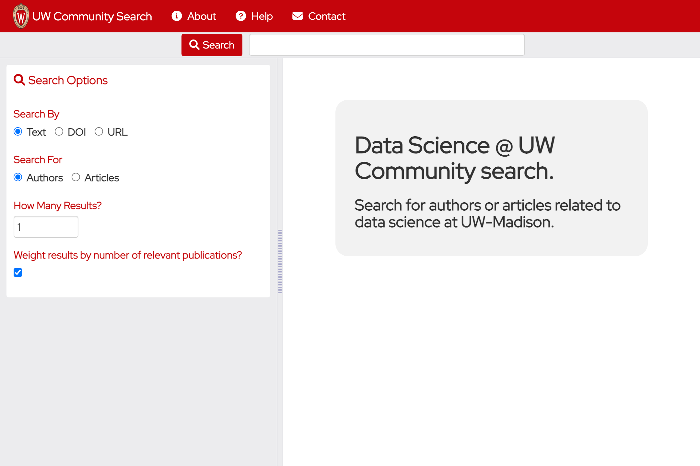

<p align="center">
	<div align="center">
		
	</div>
</p>

# UW Community Search

Community is an application for searching for people that are part of the University of Wisconsin-Madison community.

<div align="center">
    
    <div><i>Community Search</i></div>
</div>

## Installation

This application depends upon the following utilities which will need to be installed before you can run it:

- [Flask](https://flask.palletsprojects.com/en/2.3.x/installation/)

Flask is a Python framework that is used for the back end web services.

```
pip install Flask

```

## Running

Start the Flask app using the following command:

```
python3 app.py
```

After starting the server, to run the application, open your web browser to:

```
http://localhost:5000
```

<!-- LICENSE -->
## License

Distributed under the permissive MIT license. See the [license](./LICENSE.txt) for more information.

<!-- Acknowledgements -->
## Acknowledgements

This software was created by the [American Family Insurance Data Science Institute](https://datascience.wisc.edu/) at the [University of Wisconsin-Madison](https://www.wisc.edu/) under a grant from [IRIS Hep](https://iris-hep.org/)